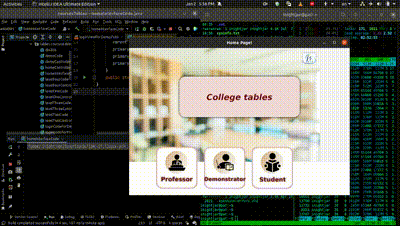
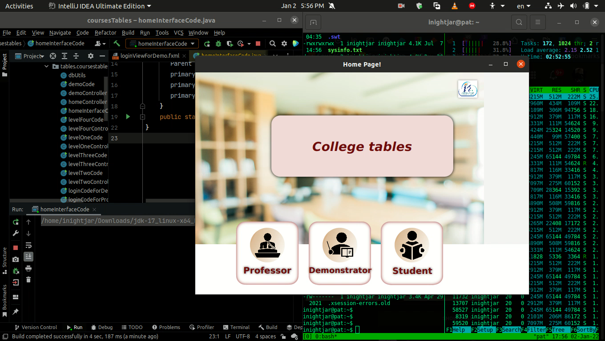
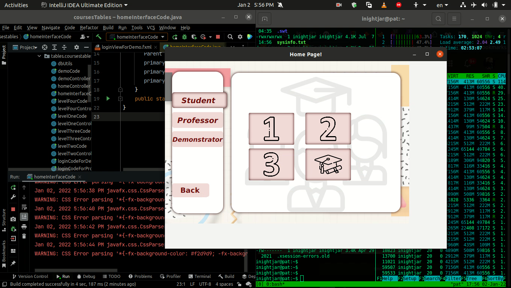
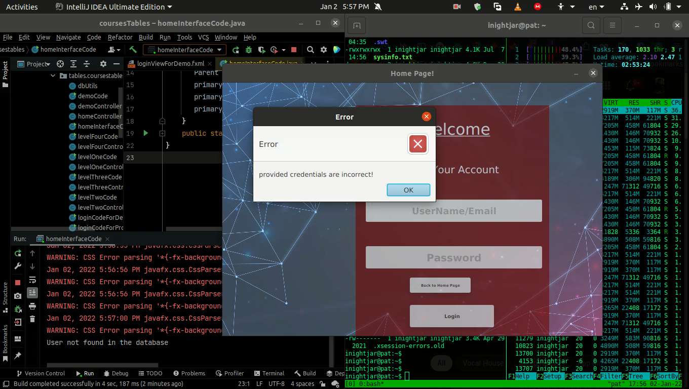

## JAVAFX College Courses Information Table.

Project I made using 
### `MVC Pattern`  
Tools I used : 
### `JavaFX and MySQL Normalized Database`

### Demonstration

  

<!--    
   
    -->
 

### `Source Code Structure`

 
MVC Pattern : 

#### `Make and Control Patterns Under: /src/main/java/tables/coursestables` 
#### `View Patterns Under: /src/resources/java/tables/coursestables`

### Normalized MYSQL DataBase

### GUI Using SceneBuilder
