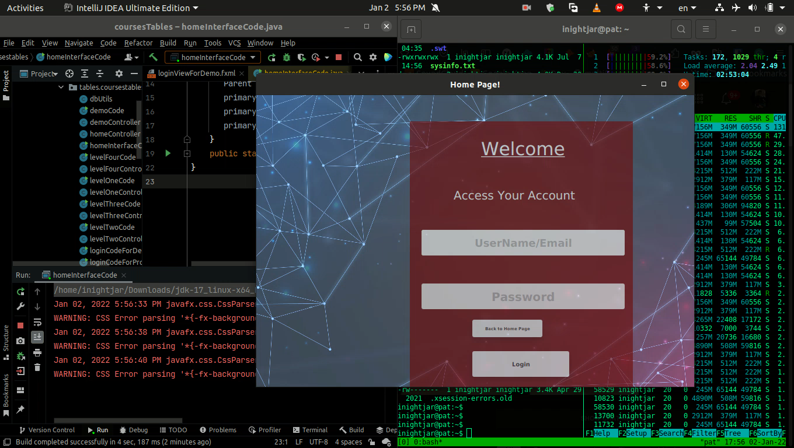
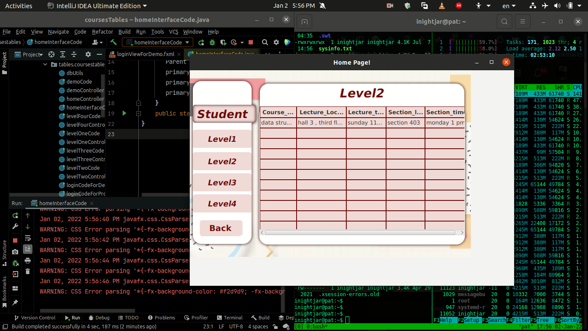
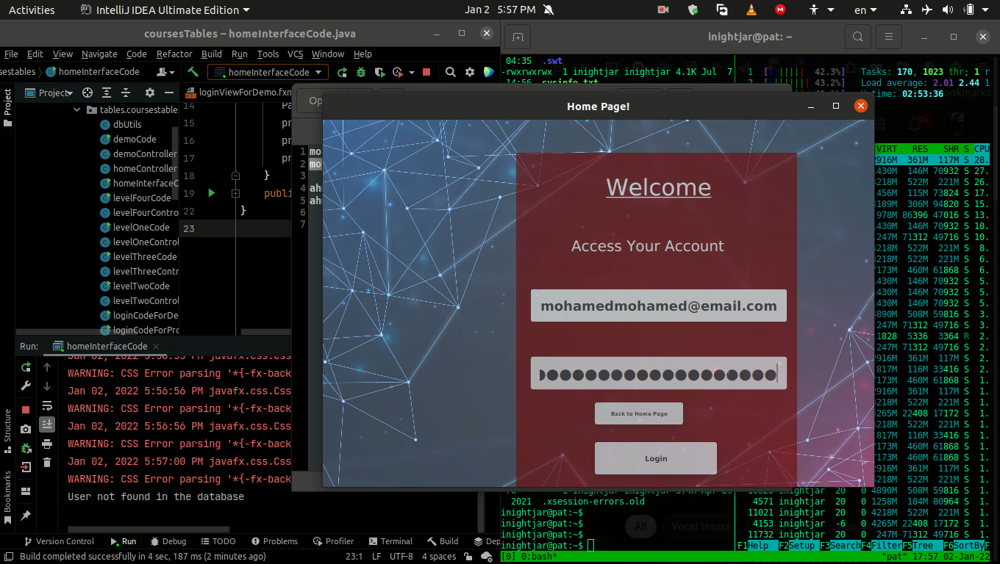
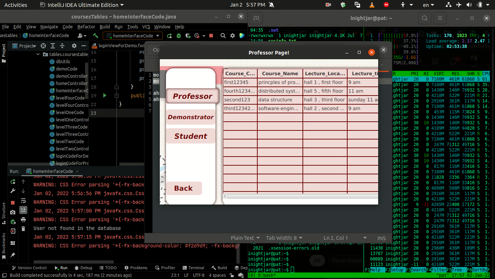

# JAVAFX College Courses Information Table.

Project I made using MVC Pattern.   
Tools I used : JavaFX and MySQL Normalized Database.  

# Demonstration Photos.

 
   
  
  
  
  
  
  
  
  
  
  

# Source Code Structure

 
Appling MVC Pattern you will find :
Make and Control Patterns Under: /src/main/java/tables/coursestables.
View Patterns Under: /src/resources/java/tables/coursestables.
  

# Normalized MYSQL DataBase

  

# GUI Using SceneBuilder
